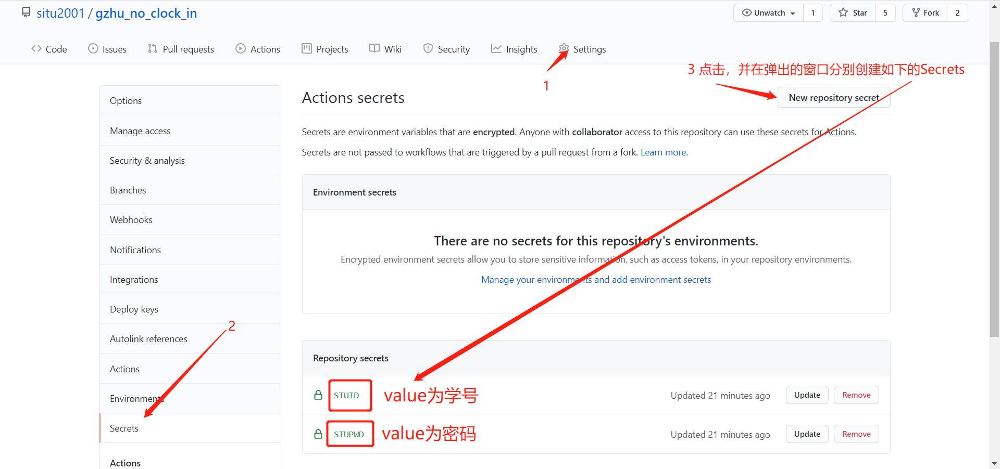
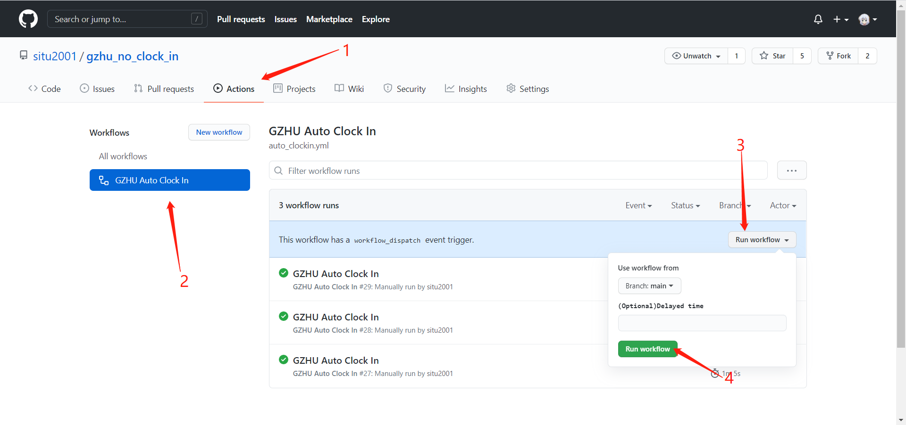
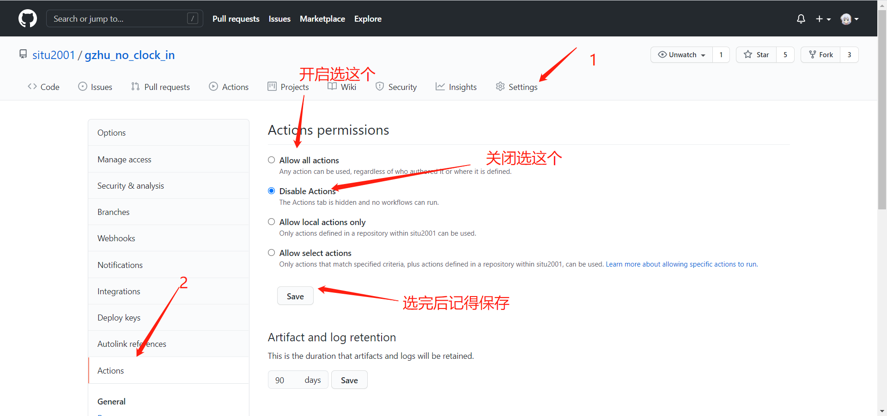
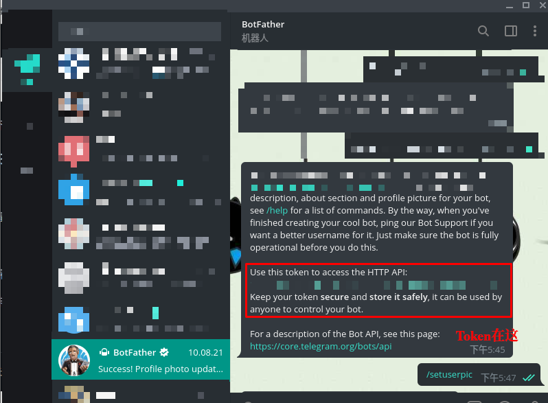
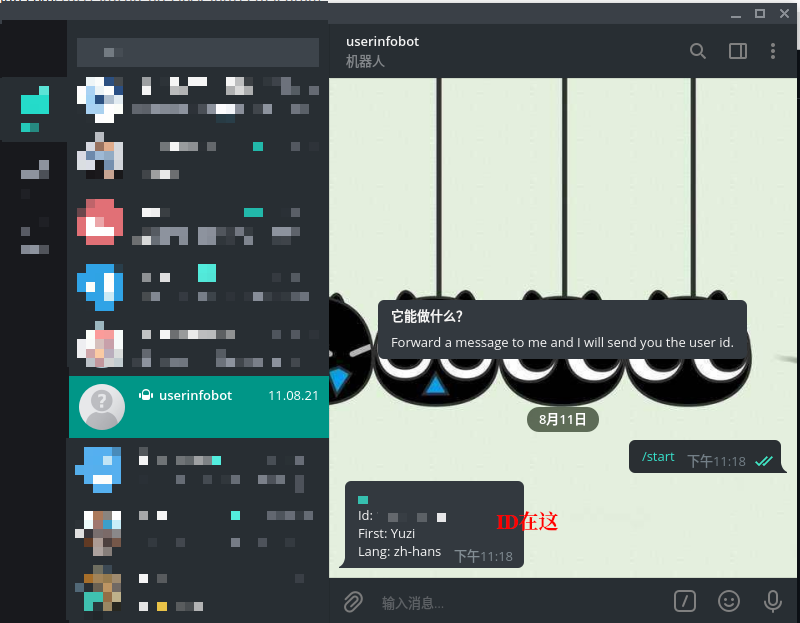

# gzhu_no_clock_in

## 写在前面

本打卡脚本**仅供学习交流使用**，请勿过分依赖。开发者对使用或不使用本脚本造成的问题**不负任何责任**，不对脚本执行效果做出任何担保，原则上**不提供任何形式的技术支持**。

由于众所周知的**垃圾**校园网，使用GitHub Action自动打卡有不小的几率会失败，如有收到Action执行失败的通知邮件，请及时进行手动打卡。

Telegram推送结果功能由[@Yuzi19](https://github.com/Yuzi19) 提供支持，**注意，即使你不使用Telegram推送功能，也请在Secrets的TOKEN一项中输入None。**

## 如何食用

**首先**把该项目**Fork一份**（在网页右上角，点Fork前记得顺便**点个Star**哦~），然后去到你fork下来的仓库里。

接着，如图所示进行操作。



**注意，即使你不使用Telegram推送功能，也请在Secrets的TOKEN一项中输入None！！**

Action会在每日7点运行，如果需要手动运行Action，可根据下图进行操作



如果需要关闭自动打卡功能，请根据下图所示进行手动关闭



如需本地运行，请参考下面的说明。

### Telegram每日打卡提醒

#### 申请bot

在TG去BotFather处申请一个bot，记录下token【具体请谷歌】，然后填入secrets中。



#### 获得自己的ID

在TG去userinfobot处查看自己的ID，填入secrets中的CHAT_ID中。



然后就可以获得每日打卡的提醒了！

示例：


## 如何更新

如果fork下来的仓库在未来出现如图所示


则表示需要更新，点击Fetch upstream并fetch and merge即可


---

## English Version(Outdated)

Before using this tool, you must have previously submitted health report **at least once** in `广州大学健康信息系统`!!

## How to use

If this is your **very first time** to use the tool, please install dependencies with following command in the root dir of the cloned repo:

``` shell
pip install -r requirements.txt
```

If you use Windows, please install `tesseract` from this [link](https://digi.bib.uni-mannheim.de/tesseract/) and add to PATH. Nodejs runtime environment is also required. Just download from [here](https://nodejs.org/) and install it.

Or if you use Ubuntu or Debian, just run your software package manager to install `tesseract` and `nodejs`. For instance, installing this package can be done by running this command.

```shell
apt install tesseract nodejs
```

Then, edit `stu_id.txt`, add your student id and your password in a new line. Note that id and password are separated by a blank space.

For example:

``` text
114514 19190810
111111 22222222
```

Run.

``` shell
python run.py
```

If `打卡成功` appears, you are free of the nettlesome clock in.

## ~~I am from the future~~

This function is **Invalidated from 2021/06/10**

~~(puns)So you can return to the past to check in. If you want to check in from 3-10(inclusive) to 3-16(inclusive), type and run this command.~~

``` shell
# python run.py -d 7
```
